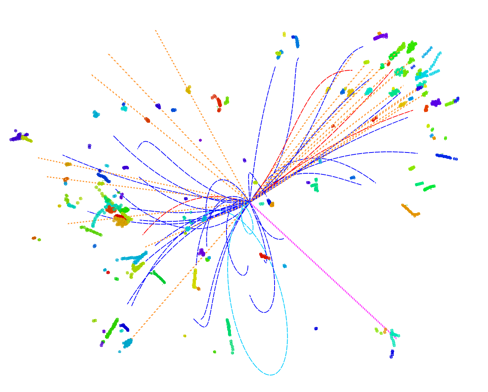

# CEPC-Jet-Origin-Identification
from generator to Jet Origin Identification (JOI)

------

## Basic
 - If you’re working in the CEPC environment on the IHEP farm, you can load the CEPC container environment using the following commands:
   * `export PATH=/cvmfs/container.ihep.ac.cn/bin:$PATH`
   * `hep_container shell CentOS7`
   * `export PATH=/cvmfs/common.ihep.ac.cn/software/hepjob/bin:$PATH`

## Generator
 - To download and install MadGraph, visit http://madgraph.phys.ucl.ac.be. Once installed, you will also need to install Pythia, ExRootAnalysis, and HepMC within MadGraph. If Pythia does not work after installation, you can try the following command to set the PYTHIA8DATA environment variable (adjust the path as needed): `export PYTHIA8DATA="/cefs/higgs/zhuyf/workspace/madgraph/MG5_aMC_v2_9_18/HEPTools/pythia8/share/Pythia8/xmldoc"`.
 - To plot the JOI matrix as shown in [https://journals.aps.org/prl/abstract/10.1103/PhysRevLett.132.221802](https://journals.aps.org/prl/abstract/10.1103/PhysRevLett.132.221802), you need to generate samples for the process e+e- -> ZH (with Z -> νν and H -> bb/cc/uu/dd/ss/gg) at a center-of-mass energy of 240 GeV. Since the Standard Model does not support H -> ss/uu/dd decays, you will need to import the HEL_UFO model in MadGraph for these samples.
After launching MadGraph, type the following command: import model HEL_UFO. MadGraph will automatically download the model and return a command for you to run—simply execute the command it provides.

<div align="center">

<p> Figure 1: Event display of an $e^+e^-\rightarrow \nu\bar{\nu} H\rightarrow \nu\bar{\nu} gg$ ($\sqrt{s}$ = 240 GeV) event simulated and reconstructed with the CEPC baseline detector. Different particles are depicted with colored curves and straight lines.</p>
</div>

## Simulation
#### Full Simulation
 - If you have access to the computing resources at the Institute of High Energy Physics, Chinese Academy of Sciences, you can perform full simulations using the CEPC Software.
 - We warmly welcome you to join the CEPC project!
 - The directory [[full_simulation]](full_simulation) contains the code used to extract features from reconstructed files (with the .slcio postfix).

#### Fast Simulation
 - Instead of running full simulations, which require intensive computing resources, you can perform fast simulations using Delphes.
 - Download a special version of Delphes from [https://github.com/oiunun/Delphes_CEPC/releases/tag/v1.0](https://github.com/oiunun/Delphes_CEPC/releases/tag/v1.0) or from [https://pan.baidu.com/s/1_cwAH2Ewol985qx-uAPIdA?pwd=sig3](https://pan.baidu.com/s/1_cwAH2Ewol985qx-uAPIdA?pwd=sig3). After downloading, unpack the files and run make to build the software. 
 - The Delphes card specifically designed for the 4th detector version of CEPC is delphes_card_CEPC_4th.tcl, located in the [[fast_simulation]](fast_simulation) directory.
 - The [[fast_simulation]](fast_simulation) directory contains the following files.
   * setup.sh sets the path for the installed Delphes.
   * subjob.sh reads the run_delphes.sh script and configures the input file (HEPMC or STDHEP), output file, and card paths.
   * makeNtuples.C demonstrates how to extract the data features required for model training.


## Install Miniconda3, weaver, and ParticleNet
 - Install Miniconda3 according to your operating system. You can install it using the following commands specific to your OS. After installation, make sure to update the env_conda.sh script by changing the path to point to your installed Miniconda3 directory.
 ```
$ wget https://repo.anaconda.com/miniconda/Miniconda3-latest-linux-x86_64.sh
$ chmod +x Miniconda3-latest-Linux-x86_64.sh
$ ./Miniconda3-latest-Linux-x86_64.sh
$ source env_conda.sh
```
 - Create a virtual environment, activate it, and install PyTorch (based on your OS/CUDA version from [https://pytorch.org/get-started](https://pytorch.org/get-started)) and weaver by running the following commands. 
```
$ conda create -n weaver python=3.10
$ conda activate weaver
$ conda install pytorch==1.13.1 torchvision==0.14.1 torchaudio==0.13.1 pytorch-cuda=11.6 -c pytorch -c nvidia
$ pip install weaver-core
```
 - If you encounter issues with the Weaver environment, you can delete the environment using the following command, and then recreate it using the commands mentioned above.
```
$ conda env remove --name weaver
```
#### Install ParticleNet
 -Download ParticleNet and Particle Transformer from the official GitHub repository  https://github.com/jet-universe/particle_transformer. . If your analysis uses code from ParticleNet or Particle Transformer, make sure to cite the papers listed in the https://github.com/jet-universe/particle_transformer.
 - The directory for ParticleNet (assuming you named the directory ParticleNet when downloading) contains several important files:
   * ParticleNet/env.sh: set the input directories of samples in this file (export DATADIR_JetClass=)
   * ParticleNet/data/JetClass/JetClass_full.yaml:
     * *new_variables*: Allows you to define new variables based on the variables stored in your generated ROOT files.
     * *Pt_points*: Contains two variables used to calculate the distance between two particles in ParticleNet.
     * *pf_features*: Lists the features used to train the model.
     * *pf_vectors*: Represents the four-momentum of particles, which is used to compute pairwise features in Particle Transformer.
     * *labels*: Specifies the labels of your sample when training a classification model.
     * *observers*: Lists the variables that are not used for training the model but are retained in the files after testing.
     * *length*: Limits the number of particle candidates within the jet. In proton-proton collisions, particles are sorted by transverse momentum, while in electron-positron collisions, they are sorted by energy. If the length is larger than the number of particles in the jet, only the leading particles (up to the length value) are preserved. If the length is smaller, the program will add particles with all features set to 0.
   * ParticleNet/train_JetClass.sh: Specifies the detailed input paths, predicted output paths, and other hyperparameters.   


#### ParticleNet Usage method
 - After producing the fast simulation files and extracting the data features using [[fast_simulation/makeNtuples.C]](fast_simulation/makeNtuples.C), follow these steps:
   * Place the file [[training/JetClass_M11.yaml]](training/JetClass_M11.yaml) into the ParticleNet/data/JetClass directory.
   * Move [[training/train_JetClass_M11.sh]](training/train_JetClass_M11.sh) to your ParticleNet directory.
   * Inside the train_JetClass_M11.sh, there is a command that sources the conda environment, "source ~/env.sh". You need to modify the path in env.sh to match the location of your environment. 
   * Set the appropriate paths and parameters in [[training/train_JetClass_M11.sh]](training/train_JetClass_M11.sh), and then run the following command: sh [[training/train_JetClass_M11.sh]](training/train_JetClass_M11.sh) PN full. Here, PN refers to the ParticleNet model, and full is a placeholder that has no specific meaning in this example.
   * Alternatively, you can run: sh [[training/train_JetClass_M11.sh]](training/train_JetClass_M11.sh) ParT full, where ParT refers to the Particle Transformer model.


## Acknowledgement

We extend our heartfelt thanks to Huilin Qu and Congqiao Li for their invaluable support in utilizing ParticleNet and Particle Transformer. Our gratitude also goes to Shudong Wang and Xu Gao for their guidance in Delphes, as well as to Sitian Qian and Ze Guan for their support with Herwig.
